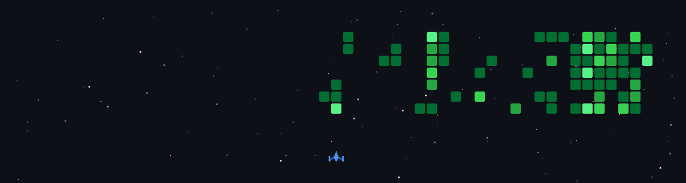

  

<h2 align="center">ML/DL | Computer Vision | Edge AI</h2>

  
  
  
  

---

### 👨‍💻 About Me

- 🔭 Currently working on **[DevLens](https://github.com/atikulmunna/devlens-fullstack)**
- 💼 Portfolio: **[atikulmunna.github.io](https://atikulmunna.github.io)**
- 📫 Reach me: **aimunna@proton.me**

---

### 🛠️ Tech Stack

<table width="100%">
  <tr>
    <td align="center" width="20%"><b>Category</b></td>
    <td align="center"><b>Technology</b></td>
  </tr>
  <tr>
    <td align="center"><b>Languages</b></td>
    <td align="center">
      
    </td>
  </tr>
  <tr>
    <td align="center"><b>AI, ML & CV</b></td>
    <td align="center">
      
      
      
      
      
      
      
    </td>
  </tr>
   <tr>
    <td align="center"><b>Database</b></td>
    <td align="center">
      
      
      
    </td>
  </tr>
  <tr>
    <td align="center"><b>Robotics & Engineering</b></td>
    <td align="center">
      
      
      
      
      
    </td>
  </tr>
  <tr>
    <td align="center"><b>Backend, DevOps & Tools</b></td>
    <td align="center">
      
    </td>
  </tr>

  
</table>

---

### 📊 GitHub Statistics

  
  

  

---

<!-- 
### 🐍 Contribution Snake

  <picture>
    <source media="(prefers-color-scheme: dark)" srcset="https://raw.githubusercontent.com/atikulmunna/atikulmunna/output/github-contribution-grid-snake-dark.svg" />
    <source media="(prefers-color-scheme: light)" srcset="https://raw.githubusercontent.com/atikulmunna/atikulmunna/output/github-contribution-grid-snake.svg" />
    
  </picture>

---

  

-->
