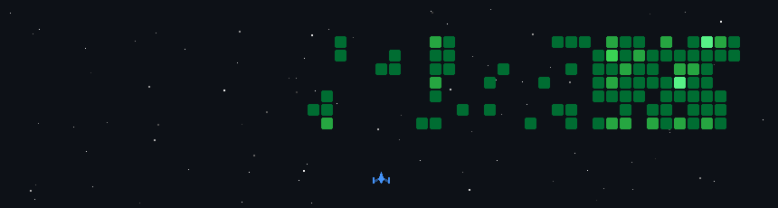

<!-- NEURAL-NET HEADER — generated by scripts/gen_neural_net.py (theme-adaptive, no JS) -->

  

 

  &nbsp;
  &nbsp;
  &nbsp;
  

 

<!-- TAGLINE — typewriter terminal line, generated by scripts/gen_tagline.py -->

  

 

---

### `~/tech-stack`

 

<!-- TECH STACK — generated by scripts/gen_tech_stack.py (theme-adaptive, no JS) -->

  

 

---

<!-- SPACE SHOOTER — contribution graph, auto-updated daily via GitHub Actions -->
<!-- Setup: czl9707/gh-space-shooter — .github/workflows/update-game.yml -->

  

 

  <code>// impossible is nothing </code>

 
