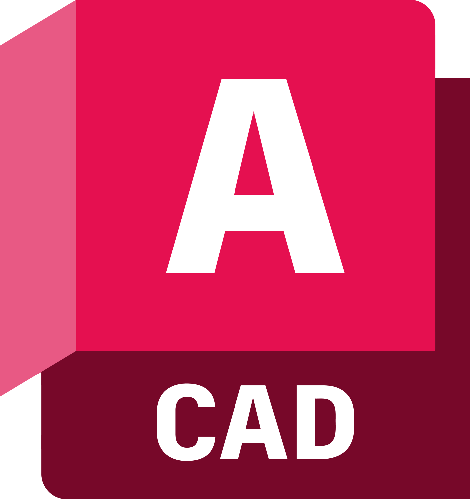

  

 

  

---

  <b>ML/DL • Computer Vision • Edge AI • Robotics</b>

---

  
  
  
  <a href="https://discord.gg/WhGUME8YGd" target="_blank">
    

### 🛠️ Tech Stack

<table width="100%">
  <tr>
    <td align="center" width="20%"><b>Category</b></td>
    <td align="center"><b>Technology</b></td>
  </tr>
  <tr>
    <td align="center"><b>Languages</b></td>
    <td align="center">
      
    </td>
  </tr>
  <tr>
    <td align="center"><b>AI, ML & CV</b></td>
    <td align="center">
      
      
    </td>
  </tr>
   <tr>
    <td align="center"><b>Database</b></td>
    <td align="center">
      
      
      
    </td>
  </tr>
  <tr>
    <td align="center"><b>Robotics & Engineering</b></td>
    <td align="center">
      
      
      
      
      
    </td>
  </tr>
  <tr>
    <td align="center"><b>Backend, DevOps & Tools</b></td>
    <td align="center">
      
    </td>
  </tr>

  
</table>

---
<!--
### 📊 GitHub Statistics

  
  

<!-- 

  

---
 
### 🐍 Contribution Snake

  <picture>
    <source media="(prefers-color-scheme: dark)" srcset="https://raw.githubusercontent.com/atikulmunna/atikulmunna/output/github-contribution-grid-snake-dark.svg" />
    <source media="(prefers-color-scheme: light)" srcset="https://raw.githubusercontent.com/atikulmunna/atikulmunna/output/github-contribution-grid-snake.svg" />
    
  </picture>

---

  

-->
